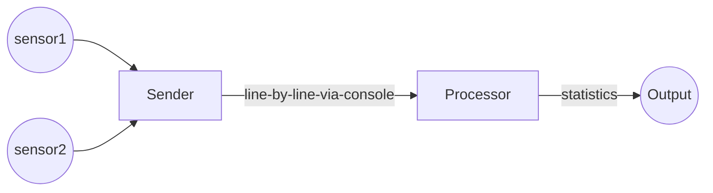

# Streaming Data

This project is about sending and processing data from sensors.

## Decomposition

At a top level, the program runs in two processes - the Sender and the Processor.

The Sender simulates and standardizes data from sensors. It sends data line-by-line to the console, in a format that it defines.
The Processor inputs this data and computes statistics.

The Sender sends data to the Processor using [console redirection and pipes](https://ss64.com/nt/syntax-redirection.html).
They need to run on the command-line as follows:

`sender-executable | processor-executable`

This would make the console-writes of the Sender
become the console-reads of the Processor.
It gives us the flexibility of decoupling the Sender and Processor -
they can even be written in different languages.

## Phases

The project is divided into two phases:

- Develop the Sender in the first phase, complete with test cases. The syntax and meaning of the data must be evident by reading your test cases.
Do not develop the Processor yet.

We will instruct you to handover your Sender to another participant and take-over another Sender.

- Develop the Processor for the Sender you take-over.

## The Interface

We document the interface between the Sender and the Processor as test cases.

The Sender and Processor are testable on their own:

- The Sender is testable without the Processor - so we can develop
for another sensor, test and be confident about integration.
- The Processor is testable without the Sender - so we can enhance with additional statistics,
without re-testing against all Senders again.

## Decomposition of responsibility

The naming of source files within the Sender and within the Processor
give their internal decomposition.

## Minimum Functionality

This section lists the minimum functionality of the Sender and Processor.

### The Sender

- simulates and sends a set of readings - temperature, pulse rate, SPO2
- sends fifty sets of readings in a stream
- can either generate values for the parameters, or read from a file
- uses console output to communicate the parameters.

### The Processor

- reads the parameters from the console input
- after reading every parameter, it prints the following:
    - maximum and minimum values in the incoming stream
    - [simple moving average](https://www.investopedia.com/terms/s/sma.asp) of the last 5 values

## Quality Parameters

Setup the quality parameters of your project (duplication, complexity, coverage, warnings) using GitHub workflow yml files.
